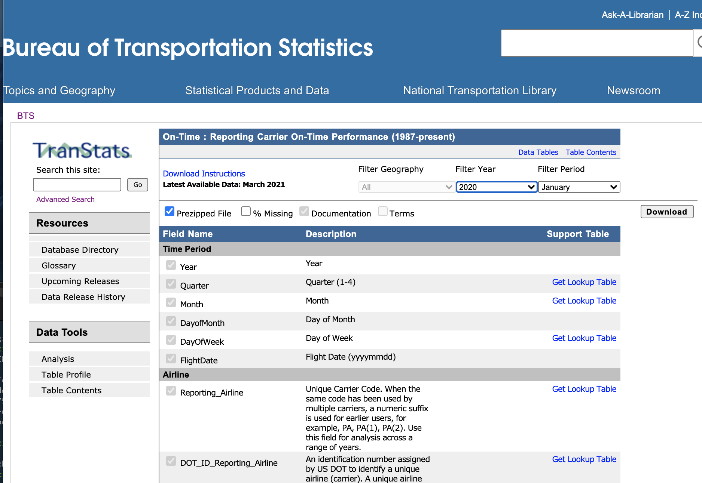
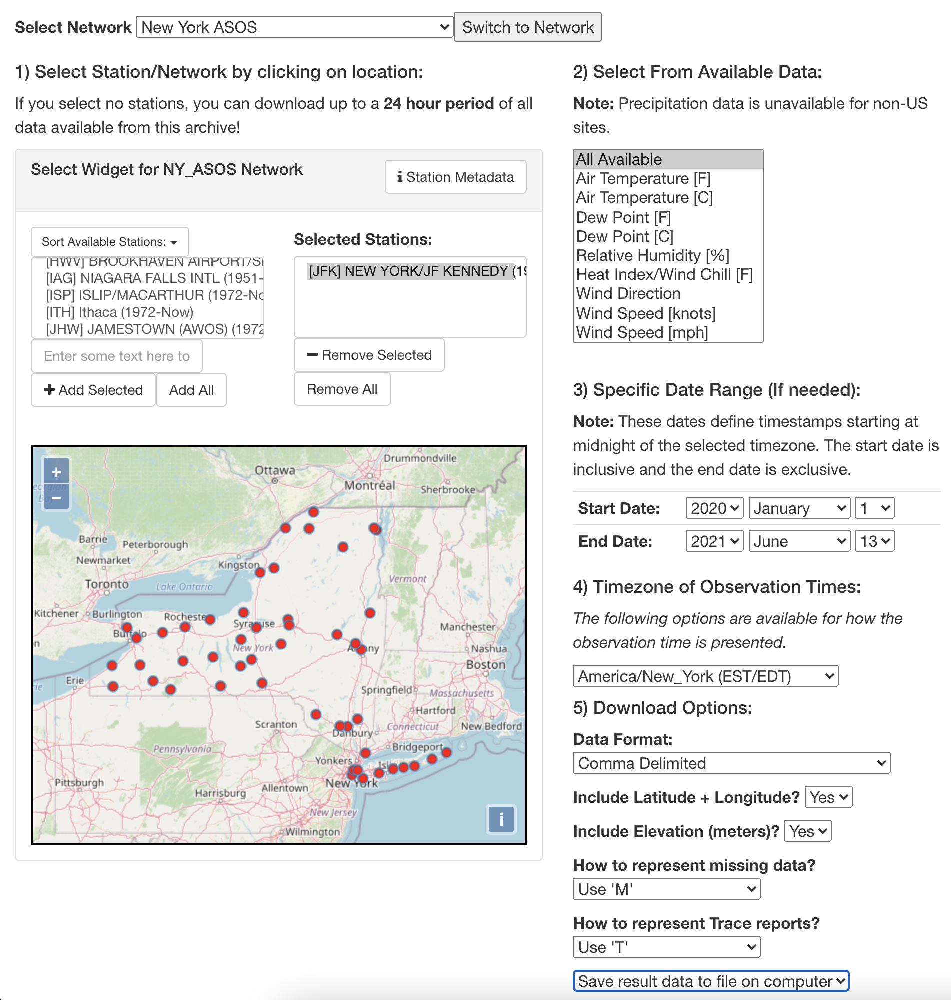
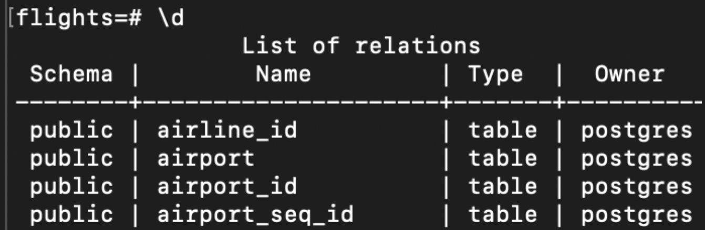
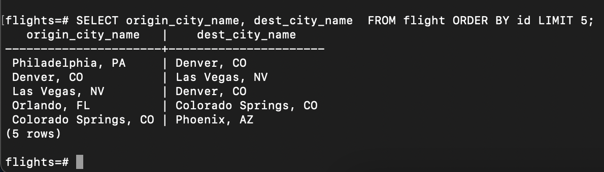

## Introduction
This project analyzes airline flights data. The work involves setting up PostgreSQL database to house the data. The data is obtained from the Bureau of Transportation Statistics web site. The data is validated, transformed, and load into the PostgreSQL's flights database for analysis. 

From there a dump of the data will be obtain and migrated to the cloud. This would be the next phase of the project. 

## Prepare environments
Create these folders and store dataset there:

1. raw_flight_data
    Download all flight data in this folder

2. raw_lookup_data
    Download lookup up table data in this folder

2. weather_data
    Download weather data in this folder

## Collecting the data
1. Download flight and lookup data:
https://www.transtats.bts.gov/DL_SelectFields.asp?gnoyr_VQ=FGJ&QO_fu146_anzr=b0-gvzr

2. Download weather data:
https://mesonet.agron.iastate.edu/request/download.phtml

# Tools needed for this project
- python 3.9
- PostgreSQL
- anaconda
- pandas
- sqlalchemy
- psycopg2
- DBeaver

## Loading the data
This assumes your postgres SQL database is up and running. It also assumes you have created a database called flight. For help setting up postgres check [Devops](https://github.com/pascallaurent/x-days-of-devops) work. Look under resources/code for PostgreSQL related instructions.

1. From step_1_flight_csv run flight_data_to_csv.py
2. From step_2_flight_sql run flight_schema_to_sql.py
3. From step_2_flight_sql run flight_data_to_sql.py
3. From step_3_other_data_sql run lookups_to_sql.py
4. From step_3_other_data_sql run weather_to_sql.py

# Checking and make sure the data loaded
1. connect to the flight database
    psql -h 192.168.1.2 -p 5432 -U postgres --dbname=flights --password

2. List the flights database tables
    \d

    

3. Query the flight table
    SELECT origin_city_name, dest_city_name  FROM flight ORDER BY id LIMIT 5;

    
